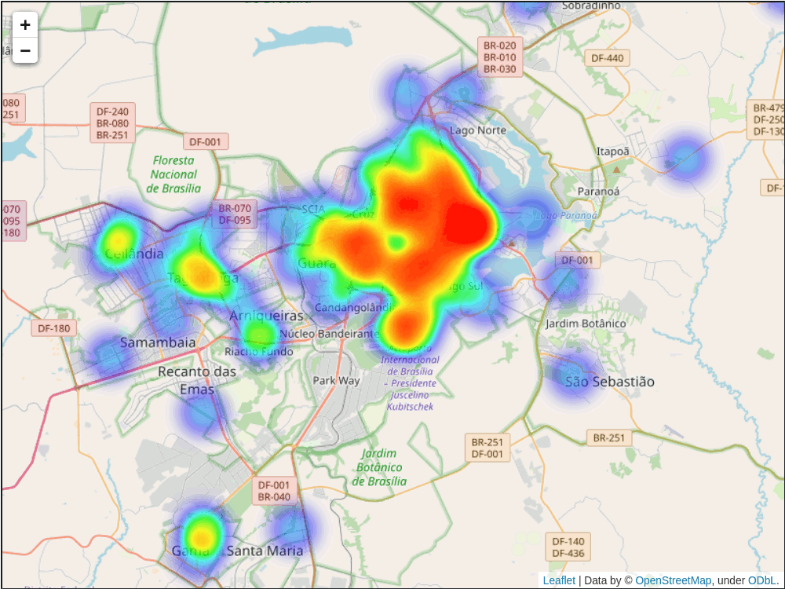

# Visualização de dados do TaxiGov

Este repositório apresenta uma visualização das corridas de táxi do
programa TaxiGov do governo federal, realizadas nos últimos 7 dias.

A visualização é atualizada diariamente, por meio de scripts do
Github Actions.

Para visualizar os dados, veja o link:

https://gestaogovbr.github.io/taxigovviz/

⚠️ Caso deseje clonar este repositório para estudar ou alterar o código em
seu próprio dispositivo, use o comando:

```bash
git clone git@github.com:gestaogovbr/taxigovviz.git --branch main --single-branch taxigovviz
```

Motivo: por padrão, o git copia todos os branches ao realizar um clone.
Este repositório inclui o branch `gh-pages`, que é imenso, só serve para
servir a página no Github Pages e seria inútil para editar.


## Tipos de visualização

* Mapa de calor
* Animação no tempo de mapa de calor
* Agrupamentos geográficos (clusters)
* Corridas individuais, uma camada por órgão

[](https://gestaogovbr.github.io/taxigovviz/)


## Dados de origem

Os dados usados na visualização podem ser baixados no seguinte link:
[taxigov-corridas-7-dias.zip](https://repositorio.dados.gov.br/seges/taxigov/v2/taxigov-corridas-7-dias.zip)

Mais informações sobre os dados podem ser encontradas no
[Portal Brasileiro de Dados Abertos](https://dados.gov.br/dados/conjuntos-dados/sistema-de-transportes-de-servidores-publicos---taxigov-v2).
